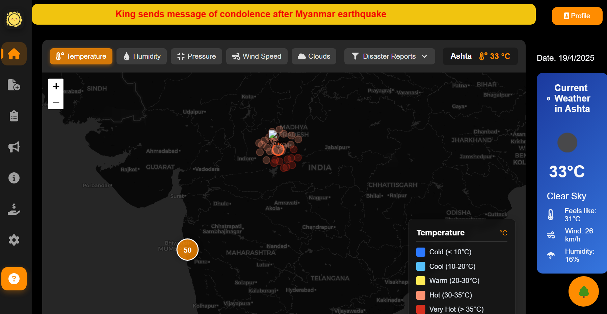
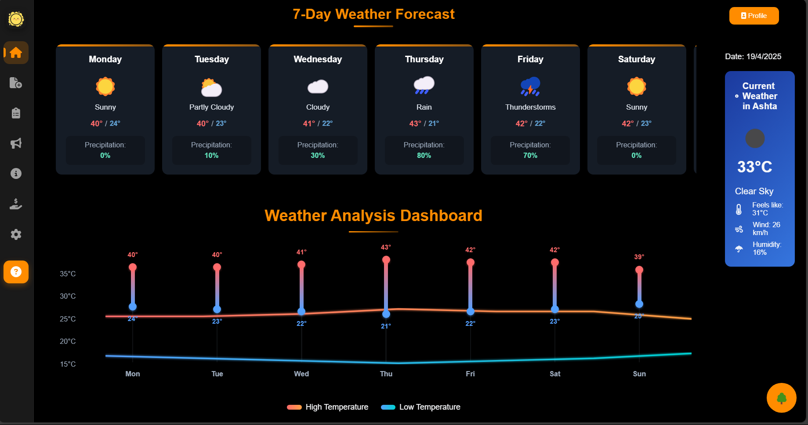
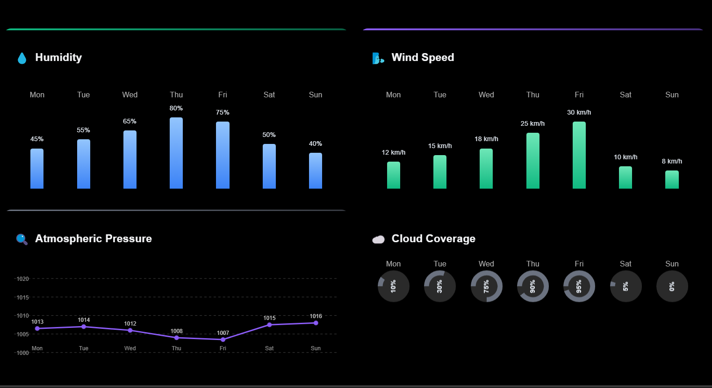
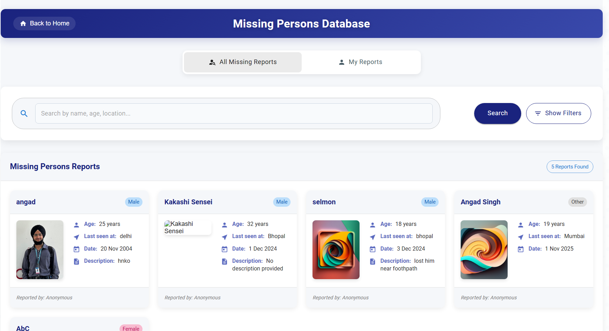
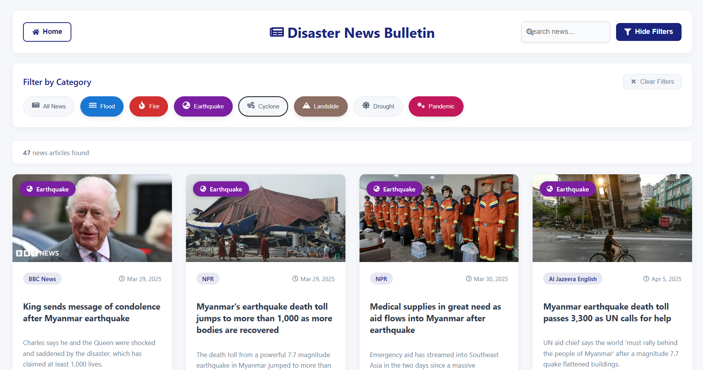
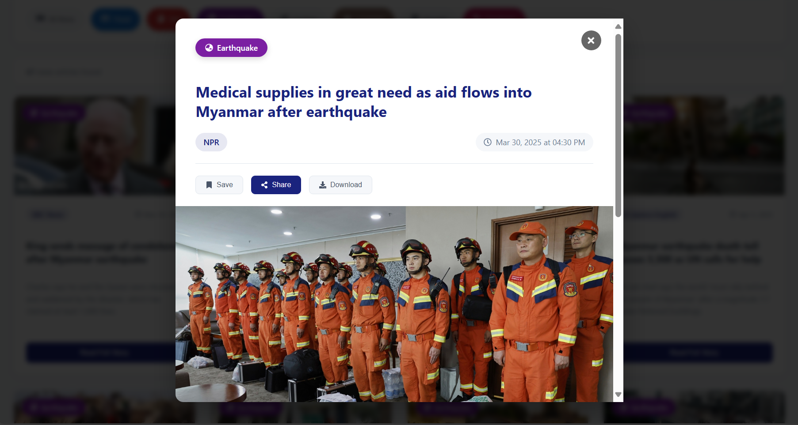
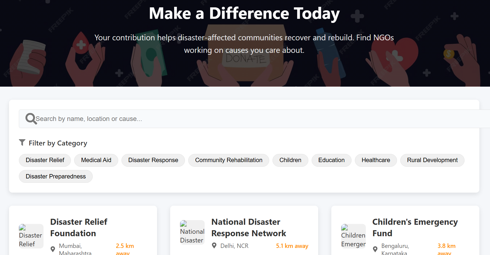
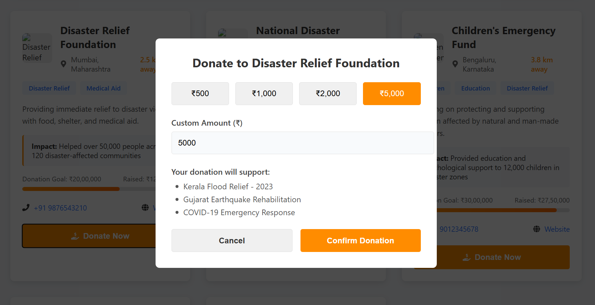
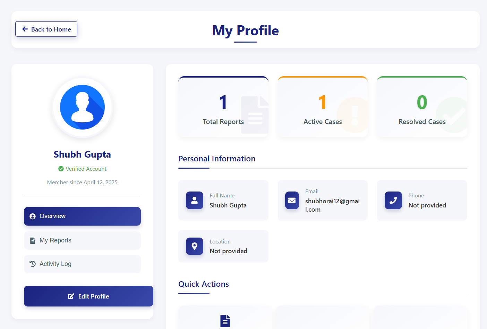

# ResQMap - Disaster Support Network


<h3>A comprehensive platform integrating real-time weather monitoring, disaster reporting, missing person tracking, and relief coordination for emergency response.</h3><br>

## 🌟 Key Features

### 🗺️ Interactive Weather Visualization

- Real-time weather data visualization with parameter-based heatmaps
- Multi-parameter monitoring (temperature, humidity, pressure, wind speed, cloud cover)
- 7-day weather forecast with detailed metrics
- Animated weather trend analysis

### 🚨 Disaster Reporting & Monitoring

- Real-time disaster reports displayed on map with clustering
- Filtering by disaster type (floods, fires, earthquakes, etc.)
- Verified/unverified report classification
- Comprehensive news bulletins with disaster updates

### 👨‍👩‍👧‍👦 Missing Person Report System

- Create, view, and manage missing person reports
- Photo upload functionality with secure storage
- Advanced search with multiple criteria
- User-specific report management

### 🤝 NGO & Donation Support

- Connect with verified disaster relief NGOs
- View NGO impact statistics and ongoing projects
- Secure donation processing
- Filter NGOs by disaster category and location

### 🤖 Emergency Assistance Chatbot

- 24/7 automated assistance for emergency guidance
- Resource location assistance
- Safety protocol information
- Connects to emergency services when needed

## 💻 Tech Stack

- **Frontend**: React, React Router, Leaflet Maps, Material-UI, FontAwesome
- **Backend**: Node.js, Express.js
- **Database**: MongoDB
- **Authentication**: JWT, Cookie-based session management
- **APIs**: OpenWeatherMap, Geolocation API, NewsAPI
- **Deployment**: Docker-ready configuration

## 📸 Screenshots

### Home Dashboard



_Interactive dashboard with real-time weather data and disaster monitoring_

### Weather Analysis


_Detailed weather analytics with multiple parameter visualization_

### Missing Person Reports


_Comprehensive missing person database with search functionality_

### Disaster News Bulletin



_Real-time disaster news aggregation and categorization_

### NGO Donation Platform



_Connect and contribute to verified disaster relief organizations_

### User Profile


_Personalized user dashboard with activity tracking_

## 🚀 Setup and Installation

### Prerequisites

- Node.js 14+ and npm
- MongoDB 4.4+
- API keys for OpenWeatherMap and NewsAPI

### Installation

1. Clone the repository

```bash
git clone https://github.com/yourusername/ResQMap.git
cd ResQMap
```

2. Install dependencies for frontend

```bash
npm install
```

3. Set up backend

```bash
cd backend
npm install
```

4. Create a `.env` file in the backend directory with the following variables:

```
PORT=9000
MONGO_URL=mongodb://localhost:27017/sahej
JWT_SECRET=your_jwt_secret_key
EMAIL_SERVICE=your_email_service
EMAIL_USER=your_email
EMAIL_PASS=your_email_password
CLIENT_URL=http://localhost:3000
```

5. Start the backend server

```bash
npm start
```

6. In a new terminal, start the frontend application

```bash
cd ..
npm start
```

7. Open your browser and navigate to `http://localhost:3000`

## 🔒 Security Features

- JWT-based authentication
- Secure cookie management
- Password hashing and salting
- Input validation and sanitization
- CORS protection
- Rate limiting for API endpoints

## 👥 Target Users

- Disaster management agencies
- Emergency responders
- NGOs and relief organizations
- General public in disaster-prone areas
- Missing person search coordinators
- Weather monitoring services

## 🔮 Future Enhancements

- Mobile app with offline capabilities
- Integration with IoT weather sensors
- AI-powered disaster prediction
- Multi-language support
- Advanced analytics dashboard
- Community volunteer coordination

## 📊 Project Structure

```
├── public/
│   ├── images/
│   └── index.html
├── src/
│   ├── Components/
│   │   ├── MapComponent.jsx
│   │   ├── WeatherComponent.jsx
│   │   ├── ViewReports.js
│   │   ├── CreateReport.js
│   │   ├── UpdateReport.js
│   │   ├── Bulletin.js
│   │   ├── DonationPage.js
│   │   ├── ChatBot.js
│   │   ├── Sidebar.jsx
│   │   └── styles/
│   ├── App.js
│   └── index.js
├── backend/
│   ├── controllers/
│   ├── models/
│   ├── routers/
│   └── app.js
└── README.md
```

## 🖊️ Contributing

ResQMap is currently not open for public contributions as it's undergoing active development. However, we welcome feedback and suggestions to improve the platform.

## 📝 License

This project is proprietary and not open source. All rights reserved.

## 📧 Contact

For any inquiries, please contact:

- Email: shubhorai12@mail.com

---

© 2025 ResQMap Disaster Support Network. All rights reserved.

Made with ❤️ for disaster Resilience
